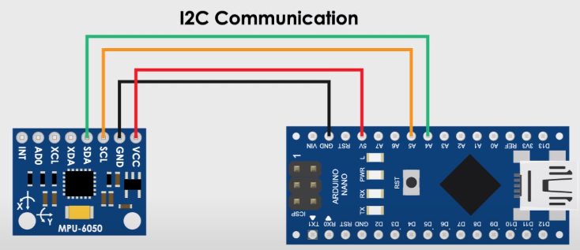

# Gesture Controlled Game
This repository is a project for EC535. In this project, we have developed a novel input method for the game tetrix. We run a modified version of QT tetrix example on the Beaglebone and interface an inertial measurement unit to it through an adruino. 

# Hardware Setup
Required Hardware:
1) Arduino Nano
2) Adafruit MPU6050

Connect the Arduino Nano and IMU module (MPU6050) as shown below



After making the connections, Upload GCG_2.ino code to Arduino. After successfully uploading the code, start serial monitor and rotate the IMU to verify if the code is working. 
Then connect the Arduino Nano to the Beaglebone as given below

 Arduino | Beaglebone
 --- |---
 TX | P9_26
 5V | P9_06
 GND | P9_02 

# QT on Beaglebone

Copy QT/tetrix to /root of the beaglebone.

Run the following commands to start tetrix.

```
stty -F /dev/ttyS1 9600
./tetrix
```
